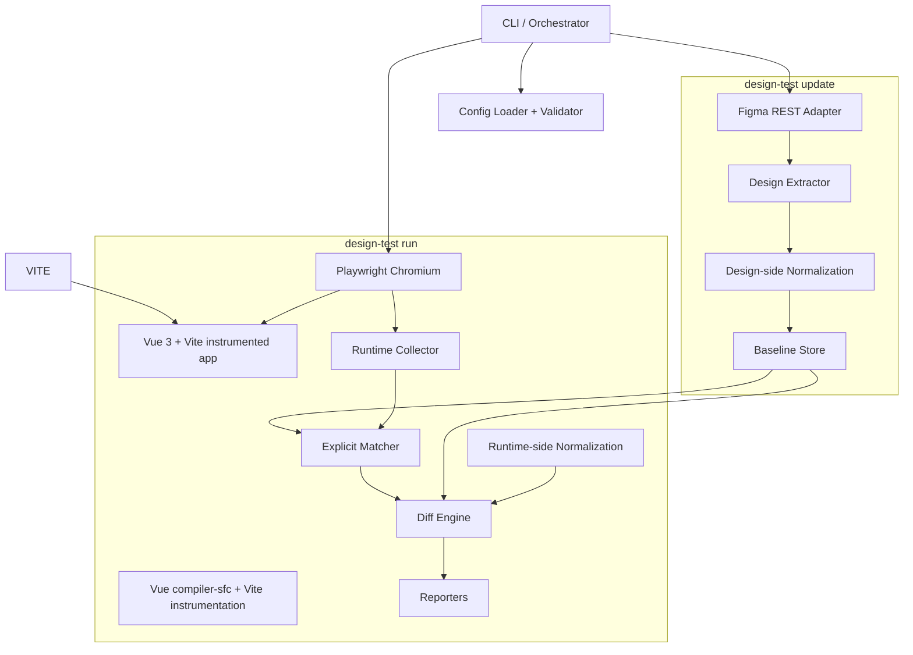
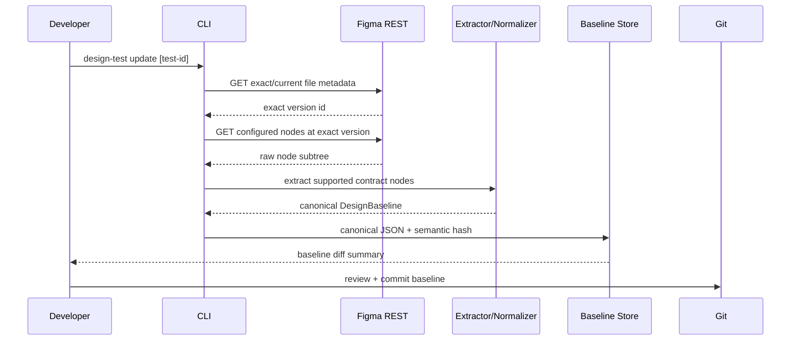
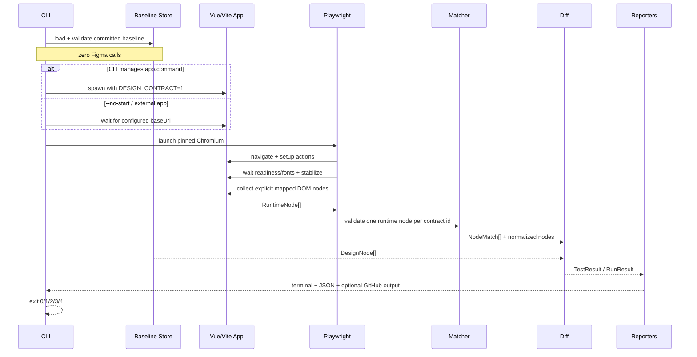
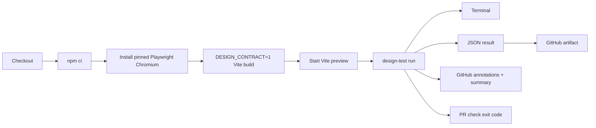
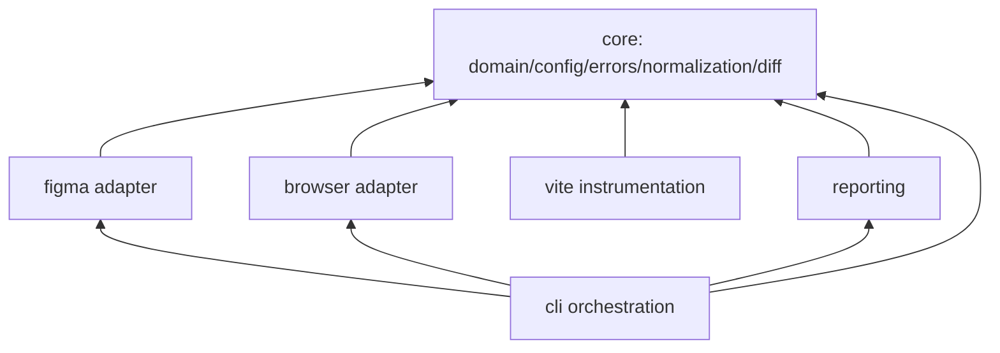

# Architecture

## Architectural rule

The MVP is one npm package with internal module boundaries. Splitting those modules into independently versioned packages is deferred until a real independent consumer exists.

## Component diagram



`DesignNode.properties` and `RuntimeNode.properties` are already canonical `NormalizedProperty` values. The diagram shows design/runtime normalization as conceptual stages; implementation may keep shared canonical conversion helpers in `core/normalization.ts` and thin adapter-specific extractors.

## Update flow



The normal update command performs two Tier-1-style Figma reads per file/version group at most: metadata/version resolution and node-subtree fetch. Requests for multiple tests sharing the same file/version should be grouped when practical.

## Run flow



## CI flow



There is no Figma token in the normal PR run. CI uses an externally built preview, so the build step sets `DESIGN_CONTRACT=1`; ordinary managed local `run` injects the same variable automatically.

`SourceLocation` is optional in the base domain model so Spike 1 can execute. After Vue Spike 2A, source presence is a supported-run invariant enforced by orchestration, not by introducing a second domain type. Shadow DOM traversal is intentionally deferred to Spike 2B.

## Internal module layout

```text
src/
  core/
    domain.ts
    config.ts
    errors.ts
    canonical-json.ts
    normalization.ts
    diff.ts
  figma/
    client.ts
    extract.ts
    baseline.ts
  browser/
    runner.ts
    setup.ts
    collect.ts
    stabilize.ts
  vite/
    plugin.ts
    transform.ts
  reporting/
    terminal.ts
    json.ts
    github.ts
  cli/
    init.ts
    update.ts
    run.ts
    main.ts
```

## Dependency direction



Hard rules:

- `core` imports no Figma, Playwright, Vite or GitHub implementation.
- `figma` does not import `browser`.
- `browser` does not import `figma`.
- `reporting` accepts domain results and imports neither Playwright nor Figma.
- `vite` may use the shared `SourceLocation` serialization helper but no browser/Figma code.
- `cli` is the composition root.
- No cycles.

## Why not a monorepo

A monorepo would create multiple package manifests, version boundaries and release coordination before there is any separate consumer. The MVP has one CLI release, one Vite integration, one browser engine and one domain version. A single package keeps atomic changes and one lockfile while still preserving module boundaries.

Split into packages only when one of these becomes true:

1. Vite plugin gets a separate release cadence;
2. core engine is consumed by another tool without CLI;
3. a second framework adapter requires independently installable integrations.

## Runtime boundaries

- Figma REST is external only to `update`.
- Browser automation is external only to `run`.
- Baseline JSON is the serialization boundary between update and run.
- `RunResult` is the serialization boundary between core comparison and reporters.

## Deliberately absent architecture

No backend, database, authentication service, queues, billing, cloud object storage, screenshot service, vector database, AI service or hosted dashboard is part of the MVP.
